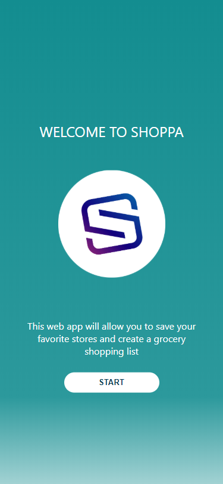
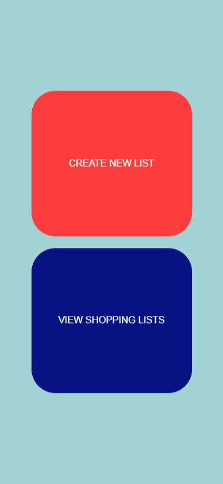
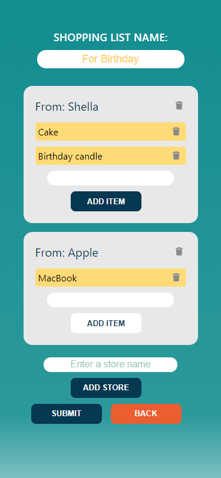
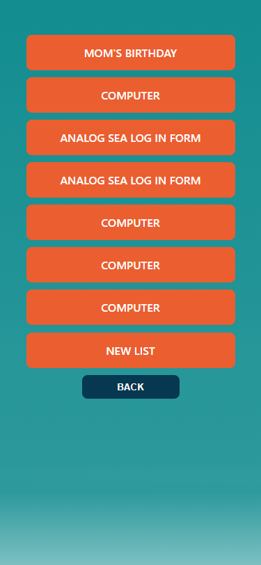
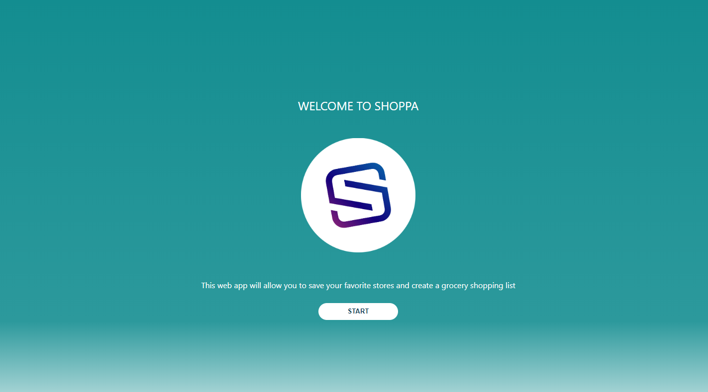
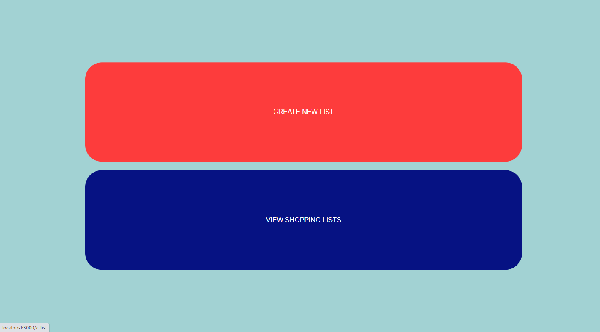
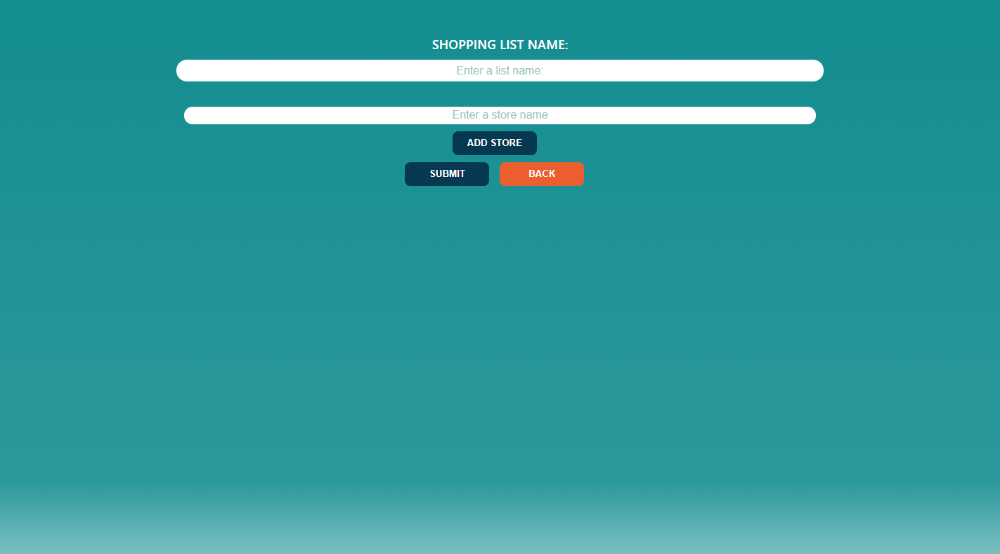
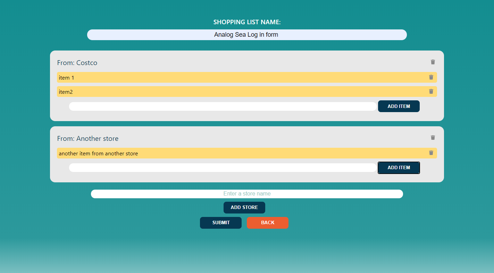
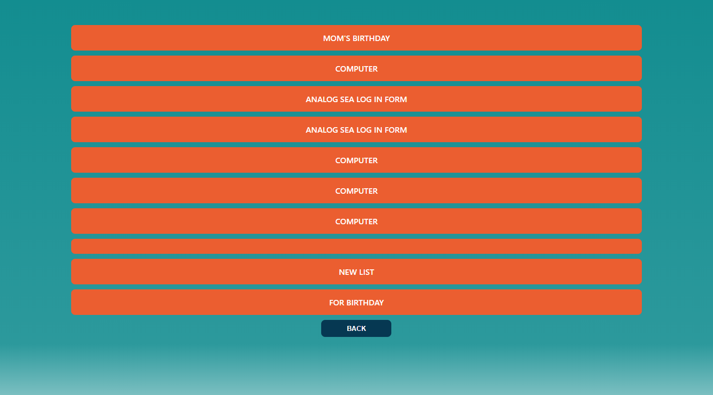
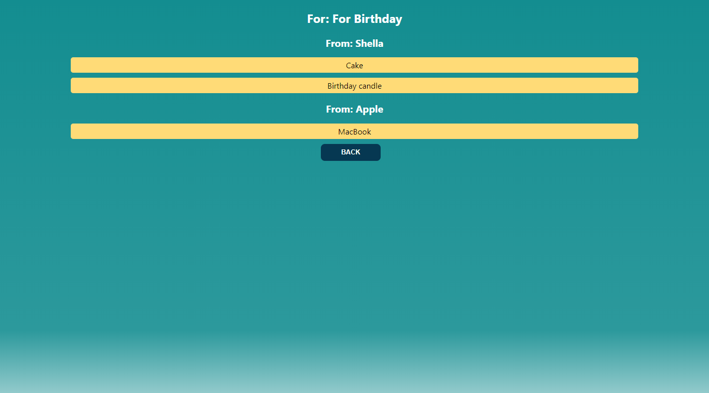

# Shoppa APP

Shoppa app is basically created for my own family to create shopping list that we make by our handwriting everyweek, And it the piece of paper list gets lost sometimes which makes us to miss something that I needed which cause us to go to the same store twice.

Contains functions to enable CRUD operations for client side application. Deployed with Heroku

## LINK TO LIVE APP

```
https://shoppa-client.vercel.app/
```

## TECHNOLOGIES USED

- Node
- Express Framework
- Chai
- Mocha
- Knex

### FUNCTIONALITY

The app uses GET, POST requests to the Database server

### Adding shopping list with following keys:

shoppingList: [
{
id: 1,
title: "new list",
items: {
1: [
{ id: 123, name: "apple" },
{ id: 234, name: "banana" },
],
},
stores: [
{
id: 1,
name: "costco",
},
],
},
{

## API Overview

### Events GET

@route GET /shoppinglists/ @desc Gets all shopping lists options @access Public
route.get('/');
@route GET by id /shoppinglist/:id @desc Gets specific shopping list with req.params.id options @access Public
route.get('/');
@route POST /shoppinglists/ @desc Allows users to place an order @access Public
route.post('/');

### SCREENSHOTS

#### Mobile Screenshots

1. Mobile Landing Page\
   
2. Mobile Nav page\
   
3. Mobile New shopping list form page\
   
4. Mobile Post form filled out\
   
5. Mobile Shopping lists\
   
6. Mobile Shopping list\
   

#### Desktop Screenshots

1. Desktop Landing Page\
   
2. Desktop Nav page\
   
3. Desktop New shopping list form page\
   
4. Desktop Post form filled out\
   
5. Desktop Shopping lists\
   
6. Desktop Shopping list\
   
